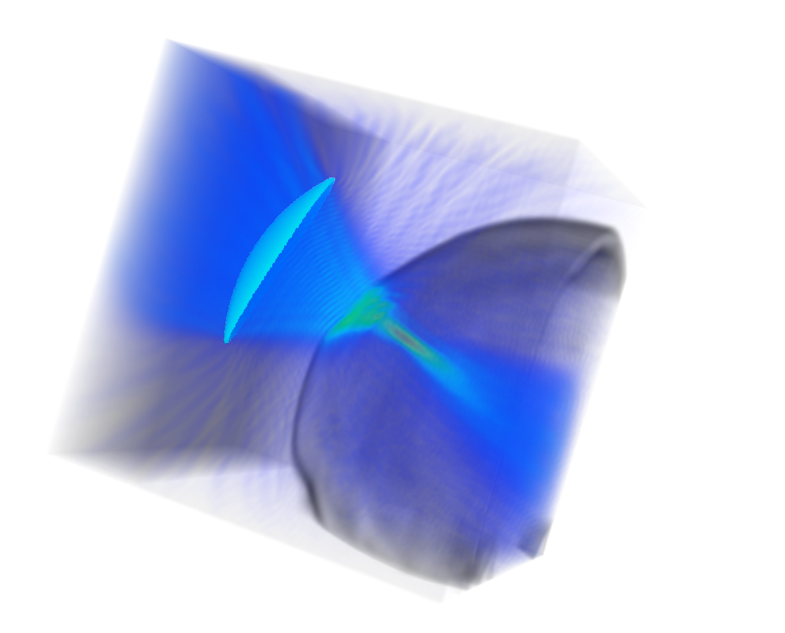

<div align="center">
<a href="http://camma.u-strasbg.fr/">

</a>
</div>

# TFUScapes
**A Skull-Adaptive Framework for AI-Based 3D Transcranial Focused Ultrasound Simulation**

_Vinkle Srivastav, Juliette Puel, Jonathan Vappou, Elijah Van Houten, Paolo Cabras, Nicolas Padoy_


This repository contains the link to download the dataset as well as visualization script to visualize the data.


### DATASET DESCRIPTION

The **TFUScapes** dataset includes _2,500_ simulations spanning _125_ subjects, with _20_ transducer placements per subject emitting a wave at a frequency of _500_ kHz.

## Download the TFUScapes dataset and install the dependencies
The **TFUScapes** dataset is hosted on the [unistra S3 server](https://s3.unistra.fr/camma_public/datasets/TFUScapes/TFUScapes.zip). Please download the dataset and install the dependencies using the commands given below.

```bash
$ TFUScapes=/path/to/tfuscapes/repository
$ git clone https://github.com/CAMMA-public/TFUScapes $TFUScapes
$ cd $TFUScapes/
$ cd dataset && wget https://s3.unistra.fr/camma_public/datasets/TFUScapes/TFUScapes.zip
$ unzip -q TFUScapes.zip && rm TFUScapes.zip && cd ..
$ # Install Python dependencies
$ pip install vtk numpy
```

## 3D Transcranial Focsued Ultrasound Visualization with VTK

The Python script [`visualize.py`](visualize.py) provides a fast and interactive 3D visualization of transcranial ultrasound data, including:

- **cropped pseudo-CT volume** (e.g. skull anatomy)
- **Corresponding pressure map** (from acoustic simulations)
- **Transducer coordinates** (3D point cloud)

There is sample file (`./sample/TFUScapes/data/A00060925/exp_0.npz`) that can be used to visualize one sample simulation without downloading the data. It uses the [VTK](https://vtk.org/) library for GPU-accelerated volume rendering and 3D point plotting.

### usage
```bash
$ python visualize_vtk.py 
# change path in the main function (sample_path) to visualize a different sample
```

### Sample visualization
<div align="center">
  
</div>


### Disclaimer

It is important to emphasize that the dataset are intended strictly for research purposes. The dataset **TFUScapes** is **not validated** for clinical decision-making and must not be used as a substitute for certified medical devices or simulation platforms. As with any simulation-based method in biomedical contexts, there remains a risk that third parties could employ these tools beyond their intended scope. To mitigate this, clear disclaimers and licensing restrictions have been implemented to underscore the non-clinical nature of the data and promote responsible use. Broader impact is expected in terms of advancing reproducibility and collaboration in scientific computing, particularly in the development of data-driven methods for neurotechnology and therapeutic ultrasound.


### License
This source code, and dataset are licensed under the license found in the [`LICENSE`](LICENSE) file in the root directory of this source tree.
The **TFUScapes** dataset is publicly released under the Creative Commons license [CC-BY-NC-SA 4.0](https://creativecommons.org/licenses/by-nc-sa/4.0/). This implies that:
- the dataset cannot be used for commercial purposes,
- the dataset can be transformed (additional annotations, etc.),
- the dataset can be redistributed as long as it is redistributed under the same license with the obligation to cite the contributing work which led to the generation of the **TFUScapes** dataset (mentioned above).

By downloading and using this dataset, you agree on these terms and conditions.